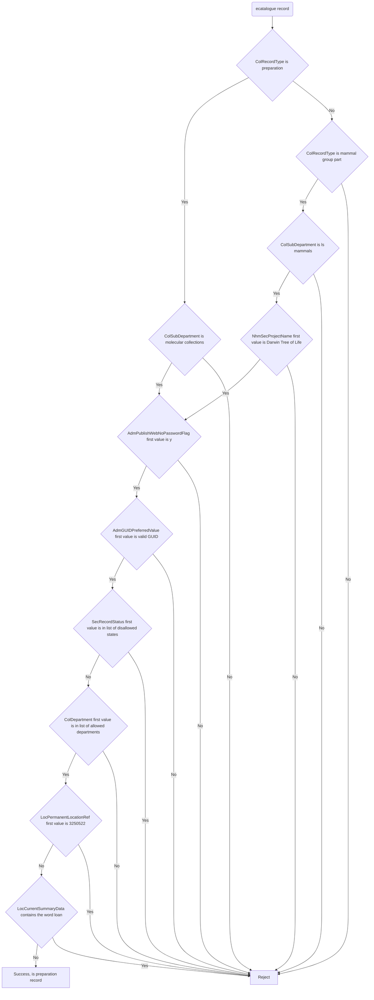

# EMu views

This directory contains the views derived from EMu data.
Each module contains one view subclass along with any additional functions required to
make the view work.
Additionally, there is a `utils` module containing common functions and variables.

## Common checks

### Departments

In ecatalogue derived views it is common for the first value in the `ColDepartment`
field to be checked against this list of values:

- Botany
- Entomology
- Mineralogy
- Palaeontology
- Zoology

If the value is in this list then the record is valid and can proceed with any other
filter checks.

### Disallowed states

In ecatalogue derived views it is common for the first value in the `SecRecordStatus`
field to be checked against this list of values:

- DELETE
- DELETE-MERGED
- DUPLICATION
- Disposed of
- FROZEN ARK
- INVALID
- POSSIBLE TYPE
- PROBLEM
- Re-registered in error
- Reserved
- Retired
- Retired (see Notes)
- SCAN_cat
- See Notes
- Specimen missing - see notes
- Stub
- Stub Record
- Stub record

If the value matches any of these values it will be rejected.

## View Definitions

### preparation

Represents a preparation record and is published to the sample dataset on the Data
Portal.

#### Filter flowchart

