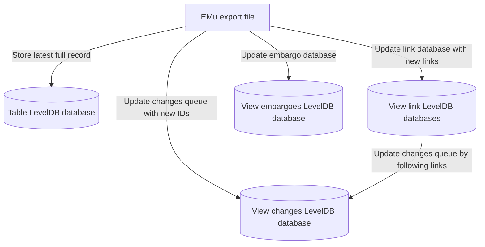
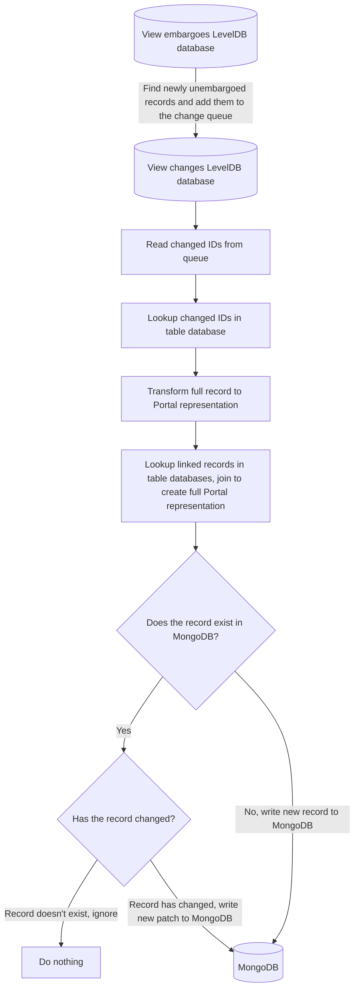
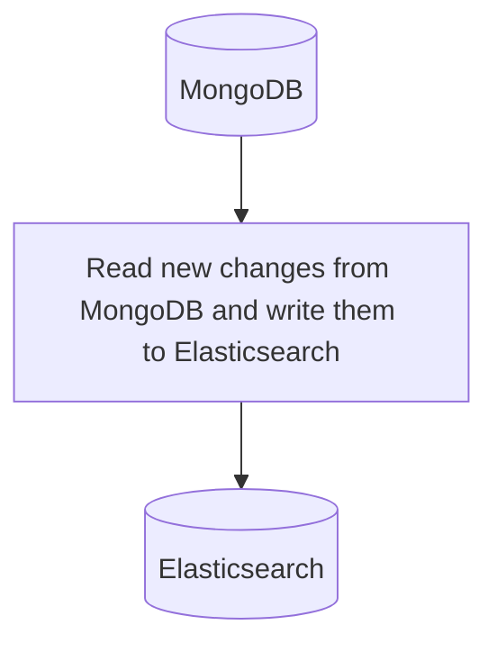

This page describes how the importer works.

## Overview

Our Collection Management System (CMS) EMu is set up to export data for the Data Portal
5 times a week (Sun, Mon, Tue, Weds, Thurs), starting at 5am each day.
Some of this data is presented on the Data Portal in
the [specimen](https://doi.org/10.5519/0002965), [index lot](https://doi.org/10.5519/0073880),
and [artefact](https://doi.org/10.5519/0016914) datasets.
The data from EMu needs to be filtered (to ensure we don't expose anything we don't want
to) and mapped to known standards (primarily Darwin Core (DwC)) before it is made
available on the Data Portal.

## Export Format

The data is exported from EMu, by EMu in a gzipped text (I think it's called texexport
by EMu) format.
We get exports of 4 EMu tables:

- `ecatalogue` - these are the object level records in EMu (can be specimens but also
  index lots)
- `emultimedia` - each item of multimedia (images, videos) has a record in this table in
  EMu
- `etaxonomy` - the taxonomy is stored in this table in EMu
- `eaudit` - the audit trail is stored in this table, we use it to perform deletions

Each record is exported individually, with the fields and values that make up the record
written to the export file line by line.
If multiple values exist for a field, then an index is added to the field name.

Here's an example:

```
fieldA:1=beans
fieldB:1=arms
fieldC:1=4
fieldC:2=7
fieldD:1=
fieldE:1=hello
```

Which is interpreted as:

- `fieldA`, `fieldB`, `fieldD`, and `fieldE` are all single value fields
- `fieldC` is a multivalue field
- `fieldD` has no value

In a Python `dict` this might look like this:

```python
{
    "fieldA": "beans",
    "fieldB": "arms",
    "fieldC": ["4", "7"],
    "fieldD": "",
    "fieldE": "hello"
}
```

All values in these exports are strings.
No type information is held in the exports (though there is a weird perl file included
in the exports folder which may contain this kind of information but we don't use it and
I've never looked at it properly).

Each record, along with its fields and values, contains a `rownum` entry, for example
`rownum=14`, which differs in style by not having a `:` or an index.

Records in the export are delimited by `###` on a line, e.g.:

```
fieldA:1=xyz
fieldB:1=328
###
fieldA:1=abc
fieldB:1=901
###
fieldA:1=efg
fieldB:1=875
###
```

Here we have 3 records.

## Process

Records are read from the EMu export texexport files as they always have been.
The data is then inserted into a set of [LevelDB](https://github.com/google/leveldb)
databases.
LevelDB is used because it provides a very fast, in process, key value store.

One LevelDB database is created per table containing the entire most recent record data.
In this database, the key is the record ID, and the value contains the record data
stored using msgpack.
Only the latest data is stored in this database so each time a record is updated, it's
value is overwritten.

To transform records from EMu records to their Data Portal representation, a series of
transformations are applied.
These transformations are grouped into a "view" along with a filter that defines which
records from the view's base table are applicable to the view and will therefore get
the transformations applied.

The views each have their own set of LevelDB databases as well:

- changes database, which contains a queue of record IDs in this view that have changed
- embargoes database, which contains a map of record IDs to their latest embargo date (
  i.e. the furthest away date. Records can have 2 embargo dates, but we only store the
  furthest away one)
- 0+ link databases, where each database stores the relationship between this view and
  another view. Inside each database, the foreign ID and the base ID are stored for
  quick lookups. One link database exists per link view linked to the base view.

An overview of the whole preperation, ingest, and index process is described next.

### Preparation Step

When a record is read from the EMu export, its data is firstly added to the table
database.
After this, the record is filtered through the views to see which ones apply, then the
various view databases are updated if needed.



### Ingest Step

When the ingest starts, any newly unembargoed record IDs are added to the change queues
for each view.
Then the change queue is iterated over in its entirety.
Each record ID is looked up from the right table database, then the data for each record
is transformed into what amounts to nearly the Portal representation of the record.
After this step, any joins are performed, this involved looking up IDs in potentially
other table databases, transforming that data, and then merging it with the base record.
Once this is complete, MongoDB is updated if needed with the new records/new changes to
existing records.



### Index Step

When the index step runs, it simply reads newly changed records from MongoDB and updates
the representation in the Elasticsearch cluster.


